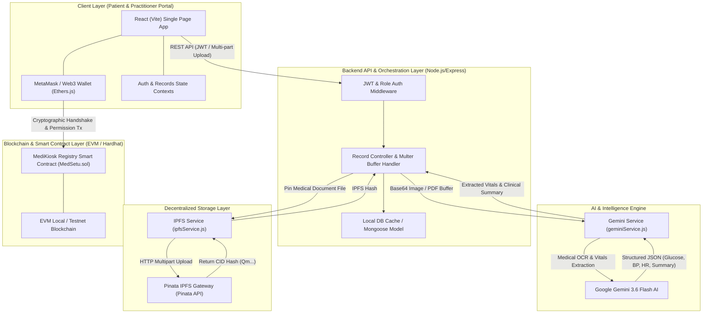

# MediKiosk: The Digital Health Sanctuary 🛡️🏥🩺

MediKiosk is a decentralized health data management ecosystem designed to empower patients with full sovereignty over their medical records. It bridges the gap between clinical institutions and individuals by providing a secure, transparent, and patient-centric "Digital Sanctuary."

---

## 🌟 Key Features

### 🛡️ For Patients (The Digital Sanctuary)
- **Unified Health Matrix**: A real-time dashboard of vitals (Heart Rate, Blood Pressure, etc.) extracted automatically from uploaded medical reports using AI model.
- **On-Chain Permissions**: Grant or revoke hospital and doctor access with cryptographic handshakes. No one sees your data without your explicit permission.
- **Medical Timeline**: A chronological view of your health history, lab tests, and clinical encounters.
- **Direct Appointment Booking**: Formal clinical consultations with verified institutions via a secure "handshake" request.

### 🩺 For Practitioners
- **Secure File Access**: View medical documents and health metrics only for patients who have granted you access.
- **Clinical Overview**: Access patient vitals and AI-summarized medical histories for faster, data-driven diagnoses.

### 🏢 For Hospital Admins
- **Clinical Node Management**: Manage a directory of authorized practitioners within the institution and monitor node health.

---

## 🏗️ System Architecture



---

## 🚀 Technology Stack

- **Frontend**: React (Vite), Vanilla CSS (High-end Clinical UI/UX), Material Symbols.
- **Backend**: Node.js, Express, MongoDB Atlas (Auth & Clinical Metadata, with local JSON fallback).
- **Blockchain**: Solidity, Hardhat, Ethereum/EVM (Permission Logic & Clinical Handshakes).
- **AI Integration**: Google Gemini AI (Automated medical report extraction & vitals analysis).
- **Storage**: IPFS via Pinata (Global, decentralized medical document storage).
- **Authentication**: JWT-based secure sessions nested within decentralized wallet mappings.

---

## 📁 Project Structure

```text
MediKiosk/
├── backend/          # Node.js/Express API & Database Logic
├── blockchain/       # Smart contracts, test scripts, and deployment logic
├── web_frontend/     # React (Vite) User Interface
└── ...
```

---

## 🛠️ Getting Started

### Prerequisites
- Node.js (v18+)
- MetaMask (or another EVM-compatible wallet)
- Gemini API Key

### Installation

1. **Clone the repository**:
   ```bash
   git clone https://github.com/AshutoshDwivedi-coder/Medikiosk.git
   cd Medikiosk
   ```

2. **Backend Setup**:
   ```bash
   cd backend
   npm install
   npm start
   ```

3. **Frontend Setup**:
   ```bash
   cd ../web_frontend
   npm install
   npm run dev
   ```

4. **Blockchain Setup**:
   ```bash
   cd ../blockchain
   npm install
   npx hardhat node
   npx hardhat run scripts/deploy.js --network localhost
   ```

---

## 🔒 Security Architecture

MediKiosk operates on the principle of **Zero-Trust Patient Sovereignty**. 
- **Decentralized Storage**: Sensitive PDFs/Images are never stored on centralized servers; they are encrypted and uploaded to IPFS.
- **Permission Layer**: Access to these files is controlled by on-chain smart contracts. Even if a server is compromised, your data remains locked behind your cryptographic keys.

---
**Built with 💚 for the future of clinical data sovereignty.**

